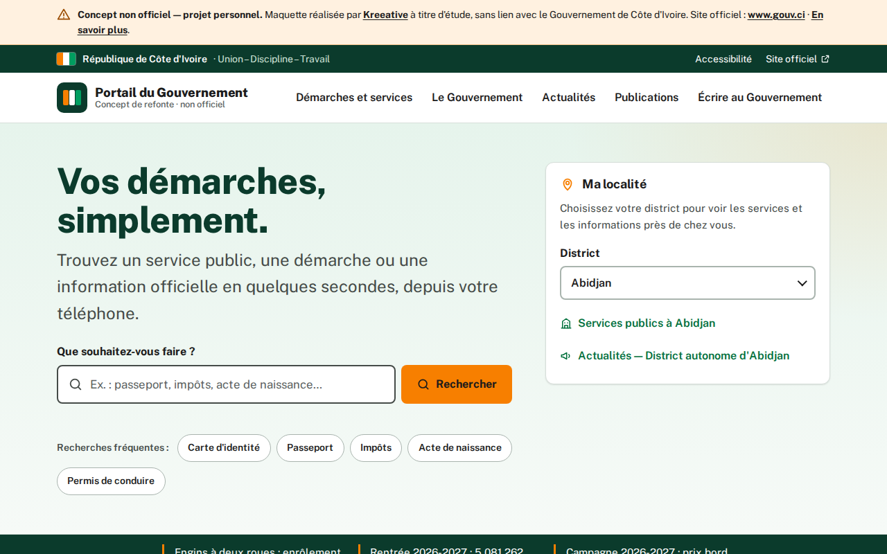
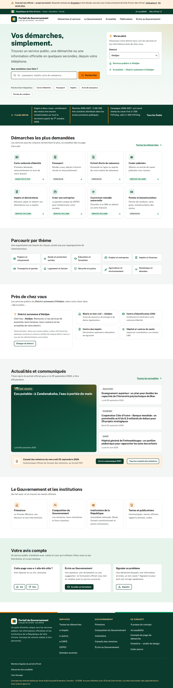


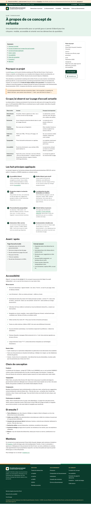

# Concept de refonte du portail gouv.ci — non officiel

> **Concept non officiel, projet personnel.** Cette maquette n'est ni commandée, ni approuvée, ni hébergée par le Gouvernement de Côte d'Ivoire. Le site officiel est [www.gouv.ci](https://www.gouv.ci). Ne présentez jamais ce concept comme officiel et ne l'hébergez pas sous une adresse qui ressemble à `gouv.ci`.

*English summary: an unofficial, personal redesign concept of the Côte d'Ivoire government portal homepage (gouv.ci), built as a static, accessible, mobile-first site by Kreeative (Anne-Kelly Kouyaté, Toronto). Not affiliated with the Ivorian government.*

## Aperçu



| Accueil (ordinateur, page entière) | Accueil (mobile, page entière) |
| --- | --- |
|  |  |

| Page de démarche (mobile) | À propos du concept (ordinateur) |
| --- | --- |
|  |  |

## Ce que c'est

Une étude de design qui montre, plutôt que décrire, ce que pourrait être un portail gouvernemental **centré sur les démarches des citoyens** : recherche en tête de page, démarches les plus demandées dès le premier écran, navigation par thème, personnalisation par district, actualités après les services, retour citoyen sur chaque page.

Trois pages :

- `index.html` : la page d'accueil, cœur du concept.
- `demarche.html` : un exemple de page de démarche (carte nationale d'identité), contenu de démonstration.
- `a-propos.html` : l'étude de cas (observations sur la page actuelle, principes, accessibilité, choix de conception, suite).

## Les principes appliqués

| Principe | Où le voir dans le concept |
| --- | --- |
| Accessibilité d'abord | Lien d'évitement, HTML sémantique, contrastes ≥ 4,5:1, focus visible, clavier, `aria-live`, un seul `h1` |
| Mobile d'abord, réactif | Une colonne sur téléphone, grilles progressives, marges de 16 px, aucun défilement horizontal |
| Navigation simple et recherche | Cinq entrées de menu, recherche avec suggestions (combobox) et recherches fréquentes |
| Démarches les plus demandées en évidence | Huit cartes de démarche sous le hero, liées aux e-services officiels |
| Personnalisation géographique | Sélecteur « Ma localité » (14 districts) qui met à jour « Près de chez vous » |
| Orienté tâches | Page type de démarche : qui, quoi, où, combien, combien de temps |
| Libre-service | e-Impôts, e-Justice, e-CNPS, CEPICI, CMU, SIGFU… reliés entre eux |
| Communication à double sens | « Votre avis compte », « Écrire au Gouvernement », signalement de problème |

## Lancer en local

Site statique, sans dépendance ni étape de build.

```bash
python3 -m http.server 8000
# puis ouvrir http://localhost:8000
```

Ouvrir directement `index.html` fonctionne aussi.

## Publier

- **GitHub Pages** : Settings → Pages → « Deploy from a branch » → branche `main`, dossier `/ (root)`. Le dépôt doit être public (ou sur un forfait GitHub payant).
- **Vercel / Netlify** : importer le dépôt, aucun réglage de build nécessaire (site statique).

Les pages portent une balise `noindex` pour éviter toute confusion avec le site officiel dans les moteurs de recherche. Retirez-la si vous souhaitez référencer le concept.

## Structure

```
index.html              # page d'accueil (concept)
demarche.html           # exemple de page de démarche
a-propos.html           # étude de cas
assets/css/styles.css   # jetons de design, composants, mises en page
assets/js/main.js       # menu, recherche, localité, retour citoyen
assets/fonts/           # Public Sans (variable, auto-hébergée, licence OFL)
assets/img/favicon.svg
docs/screenshots/       # captures utilisées dans ce README
```

## Personnaliser

- **Couleurs et typographie** : variables CSS en tête de `assets/css/styles.css` (`:root`).
- **Démarches et services** : cartes dans `index.html` (section `#services`) et index de recherche `SERVICES` dans `assets/js/main.js`.
- **Districts** : objet `DISTRICTS` dans `assets/js/main.js` et `<select id="district">` dans `index.html`.
- **Actualités** : section `#actualites` dans `index.html` (titres repris du portail officiel le 29 septembre 2026, à titre d'illustration).

## Crédits et licences

- Concept, design et code : Anne-Kelly Kouyaté, [Kreeative](https://kreeative.xyz) (Toronto), septembre 2026.
- Police Public Sans : © The Public Sans Project Authors, [SIL Open Font License 1.1](assets/fonts/LICENSE-public-sans.txt).
- Les titres d'actualité, les noms de services et les liens cités appartiennent à leurs propriétaires respectifs (gouv.ci et administrations concernées).
- Icônes : SVG originaux inclus dans les pages.
